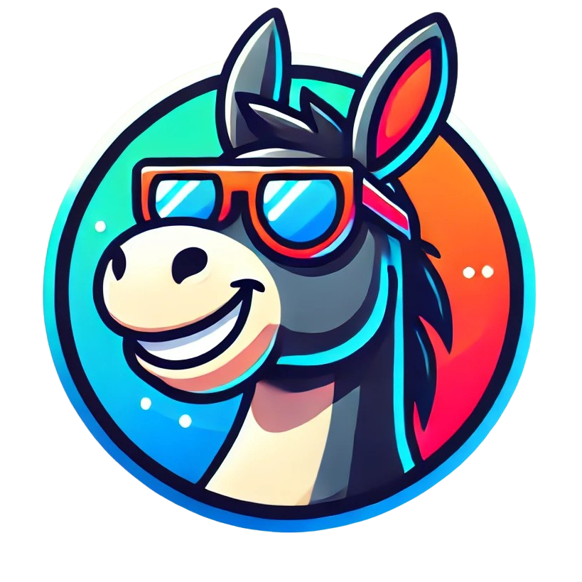
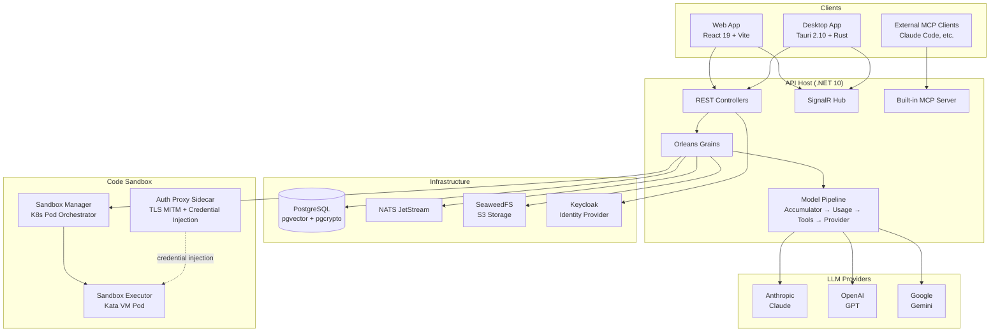
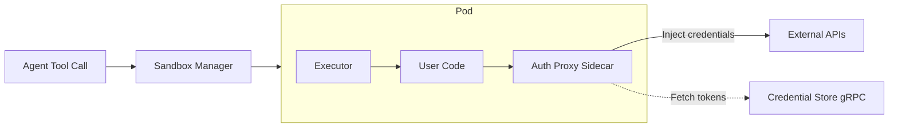

<p align="center">
  
</p>

<h1 align="center">DonkeyWork Agents</h1>

<p align="center">
  A multi-agent orchestration platform with a visual workflow editor, real-time chat, secure code sandbox, and distributed execution runtime — built on .NET 10, React 19, and Microsoft Orleans.
</p>

---

## Table of Contents

- [Overview](#overview)
- [Architecture](#architecture)
- [Navi — Conversational AI Interface](#navi--conversational-ai-interface)
- [Agent Builder](#agent-builder)
- [Orchestration Engine](#orchestration-engine)
- [Built-in MCP Server](#built-in-mcp-server)
- [External MCP Server Management](#external-mcp-server-management)
- [A2A Protocol — Inter-Agent Communication](#a2a-protocol--inter-agent-communication)
- [Secure Code Sandbox](#secure-code-sandbox)
- [OAuth Token Manager & Credential Vault](#oauth-token-manager--credential-vault)
- [Project Management](#project-management)
- [Skills — Uploadable Code Tools](#skills--uploadable-code-tools)
- [Desktop App](#desktop-app)
- [Identity & Multi-Tenancy](#identity--multi-tenancy)
- [Real-Time Notifications](#real-time-notifications)
- [LLM Providers](#llm-providers)
- [Tech Stack](#tech-stack)
- [Project Structure](#project-structure)
- [Getting Started](#getting-started)
- [Build & Test](#build--test)
- [Configuration](#configuration)
- [Deployment](#deployment)

## Overview

DonkeyWork Agents is a full-stack platform for building, managing, and executing LLM-powered agents. It combines a visual drag-and-drop workflow editor, a real-time conversational interface, project management tooling, and an isolated code execution sandbox into a single cohesive system.

Agents can call tools, spawn sub-agents, communicate with remote agents via the A2A protocol, execute code in secure Kata VM sandboxes, manage OAuth credentials, and orchestrate multi-step workflows — all coordinated through a distributed Orleans grain runtime with NATS JetStream streaming and PostgreSQL persistence.

The platform ships as a web application, a native desktop app (macOS, Windows, Linux), and exposes its own MCP server for integration with external AI tools like Claude Code.

## Architecture



### Execution Model

Agent orchestration uses Microsoft Orleans 10 actor grains:

- **ConversationGrain** — long-lived conversation orchestrator with an unbounded `Channel<T>` message queue for ordered processing, MCP server auto-discovery, A2A sub-agent spawning, and a 35-minute idle deactivation timeout
- **AgentGrain** — single-execution worker for sub-agent tasks within a conversation
- **AgentRegistryGrain** — per-conversation tracker that manages the lifecycle of all spawned agents

The model pipeline processes every LLM request through a middleware chain: **Accumulator → Usage Tracking → Tool Handling → Provider**, with streaming results delivered back to clients via SignalR observers. All grains use a `conv:{userId}:{conversationId}` key pattern for tenant isolation.

## Navi — Conversational AI Interface

Navi is the primary chat interface for interacting with agents. It provides a multi-turn conversational experience with real-time streaming, tool invocation, and rich content rendering.

**Capabilities:**

- Real-time message streaming via SignalR with Orleans grain observers
- Multi-turn conversation history persisted to PostgreSQL
- Image upload and multimodal processing
- Audio content generation and playback
- Inline tool call visualization with expandable results
- Conversation management (create, rename, delete, search)
- Configurable agent selection per conversation
- Sub-agent spawning with message routing between agents

**How it works:** When a user sends a message, the `ConversationGrain` queues it into a `Channel<ConversationMessage>`, processes it through the model pipeline with the configured LLM provider, executes any tool calls, and streams `StreamEventBase` events back to the frontend via SignalR. Messages are persisted via `IGrainMessageStore` backed by EF Core.

## Agent Builder

The agent builder is a visual configuration interface for defining agent behavior without code. Agents are composed from a set of configurable building blocks arranged on a ReactFlow canvas.

**Configuration options:**

- **Model selection** — choose the LLM provider and model (Anthropic, OpenAI, Google) with per-agent overrides
- **System prompts** — attach one or more prompts from the prompt library, or create inline
- **Tool groups** — assign sets of tools the agent can invoke (MCP tools, skills, built-in tools)
- **Sub-agent references** — link other agents as callable sub-agents for hierarchical task delegation
- **A2A server references** — connect to remote agents via the Agent-to-Agent protocol
- **Orchestration references** — trigger orchestration workflows from within an agent conversation
- **Context management** — configure conversation context window, token limits, and history trimming
- **Sandbox enablement** — assign a sandbox pod for isolated code execution with credential mapping
- **Agent metadata** — name, description, icon, and display settings

Agents are stored as versioned definitions with full CRUD support. The visual editor uses ReactFlow v12 with custom node types (`AgentBaseNode`, `AgentModelNode`, `AgentSatelliteNode`) for an intuitive drag-and-drop experience.

## Orchestration Engine

The orchestration engine is a workflow execution system built on a directed acyclic graph (DAG) model. Workflows are designed visually using ReactFlow and executed server-side with real-time progress tracking.

**Node types:**

| Node | Purpose |
|------|---------|
| **Start** | Entry point — validates input against a JSON schema |
| **End** | Exit point — returns output to the caller |
| **Model** | LLM inference — sends a prompt to a configured provider and model |
| **Multimodal Chat** | Interactive chat node with image/audio support |
| **Text-to-Speech** | Anthropic TTS synthesis |
| **Gemini TTS** | Google Gemini TTS synthesis |
| **Store Audio** | Persists generated audio with metadata to S3 storage |
| **Message Formatter** | Template-based message construction |
| **HTTP Request** | REST API calls with configurable method, headers, and body |
| **Sleep** | Timed delay between nodes |

**Execution flow:**

1. The `GraphAnalyzer` validates the DAG structure and computes execution order
2. The `NodeExecutorRegistry` maps each node type to its executor implementation
3. Nodes execute in topological order with an `ExecutionContext` carrying state between nodes
4. Each node's output is template-mapped to downstream node inputs via explicit configuration — no implicit data scanning
5. Execution events are streamed to the frontend for real-time progress visualization

**Features:**

- Version tracking with full history
- Execution history with per-node timing and output inspection
- Audio recording, synthesis, and playback within workflows
- Nested orchestration references from agent conversations

## Built-in MCP Server

DonkeyWork exposes its own Model Context Protocol server, making its project management and identity features available as tools to external AI clients like Claude Code, Cursor, or any MCP-compatible tool.

**Exposed tool providers:**

| Provider | Tools |
|----------|-------|
| **Projects** | `projects_list`, `projects_get`, `projects_create`, `projects_update`, `projects_delete` |
| **Milestones** | `milestones_list`, `milestones_get`, `milestones_create`, `milestones_update`, `milestones_delete` |
| **Tasks** | `tasks_list`, `tasks_list_by_project`, `tasks_list_by_milestone`, `tasks_get`, `tasks_create`, `tasks_update`, `tasks_delete` |
| **Notes** | `notes_list`, `notes_list_by_project`, `notes_list_by_milestone`, `notes_list_by_research`, `notes_get`, `notes_create`, `notes_update`, `notes_delete` |
| **Research** | `research_list`, `research_get`, `research_create`, `research_update`, `research_delete` |
| **Identity** | `identity_whoami` |

Tools are registered via `[McpToolProvider]` and `[McpServerTool]` attributes, with automatic discovery by the `McpToolRegistry`. The server supports API key authentication for headless integration.

## External MCP Server Management

Beyond hosting its own MCP server, DonkeyWork can connect to external MCP servers as tool sources for agents.

**Connection types:**

- **HTTP** — connect to remote MCP servers over HTTP/HTTPS with optional OAuth2 authentication
- **stdio** — connect to local MCP servers via stdin/stdout (for CLI-based tools)

**Features:**

- Dynamic tool discovery from connected servers via `McpToolDiscoveryService`
- Tool execution with parameter binding through `McpToolExecutor`
- OAuth2 authentication flow for protected HTTP servers
- Per-agent MCP server assignment in the agent builder
- Test interface for validating tool execution before assignment
- Full CRUD management via REST API and frontend UI

## A2A Protocol — Inter-Agent Communication

The Agent-to-Agent (A2A) protocol enables agents to discover and invoke tools on remote agent servers, creating a mesh of cooperating agents across different deployments.

**Capabilities:**

- **Agent discovery** — query remote A2A servers for their agent cards and available capabilities
- **Tool invocation** — call tools on remote agents as if they were local, bridged through `A2aMcpToolService`
- **Authentication** — HTTP basic auth, API key, or custom header-based authentication
- **Testing** — validate connectivity and tool execution via the test interface

**Configuration:** A2A servers are configured with a base URL and authentication details, then assigned to agents in the builder. The `A2aToolProvider` in the conversation grain handles tool routing to remote agents transparently.

## Secure Code Sandbox

The sandbox provides isolated code execution for agents that need to run user-generated or AI-generated code. It is designed with defense-in-depth security using Kata VM containers, a credential-injecting auth proxy, and Kubernetes pod lifecycle management.

### Sandbox Manager

The manager service (port 8668) orchestrates sandbox pod lifecycles on Kubernetes:

- **Pod creation and destruction** — spins up isolated Kata VM pods on demand with configurable resource limits
- **Process execution** — proxies code execution requests to the executor running inside the pod
- **Interactive terminals** — WebSocket-based terminal sessions for real-time interaction with sandbox environments
- **MCP server hosting** — manages MCP server processes running within sandbox pods
- **Background cleanup** — automatically reclaims expired or idle pods

### Sandbox Executor

The executor runs inside each Kata VM pod and handles actual code execution:

- **Multi-language support** — Python, JavaScript/Node.js, and .NET
- **gRPC communication** — `ExecutorGrpcService` for Manager-to-Executor RPC
- **Process tracking** — `ProcessTracker` manages process lifecycles, resource usage, and cleanup
- **Stdio bridging** — `StdioBridge` routes stdin/stdout/stderr streams between the manager and running processes
- **MCP server lifecycle** — starts, stops, and manages MCP servers within the sandbox

### Auth Proxy Sidecar

The auth proxy runs as a sidecar container alongside the executor, intercepting all outbound HTTP/HTTPS traffic:

- **TLS MITM interception** — `TlsMitmHandler` generates domain-specific certificates on-the-fly via `CertificateGenerator` to intercept HTTPS traffic
- **Credential injection** — injects OAuth tokens, API keys, and custom headers into outbound requests via the `headersToInject` mechanism
- **gRPC credential fetching** — `GrpcCredentialProvider` retrieves fresh OAuth tokens from the main API's `CredentialStoreGrpcService`
- **Security auditing** — logs all requests and responses with automatic redaction of sensitive headers (Authorization, Cookie, X-Api-Key, etc.)
- **Chunked transfer support** — handles both Content-Length and chunked Transfer-Encoding transparently



### Sandbox Credential Mapping

The credentials system integrates tightly with the sandbox:

- **Credential mappings** — map OAuth tokens or API keys to environment variables that code can reference
- **Custom variables** — define arbitrary key-value pairs injected into the sandbox environment
- **Per-sandbox configuration** — each sandbox pod gets its own credential and variable set via the sandbox settings UI

## OAuth Token Manager & Credential Vault

The credential system provides encrypted storage and lifecycle management for all authentication material used by agents and sandboxes.

**API keys:**

- Encrypted at rest using PostgreSQL's `pgcrypto` extension
- Per-provider storage (Anthropic, OpenAI, Google, custom)
- Used by the model pipeline to authenticate LLM requests

**OAuth tokens:**

- Full OAuth2 flow support with PKCE
- Automatic token refresh before expiry
- Multi-provider connected accounts (Google, Microsoft, GitHub, custom OAuth providers)
- Token storage with encryption
- Connected accounts UI for managing active authorizations

**OAuth client configuration:**

- Register custom OAuth providers with client ID, secret, scopes, and endpoints
- Configure authorization and token URLs
- Manage multiple OAuth clients per provider

**Sandbox credential injection:**

- Map stored credentials to sandbox environment variables
- gRPC endpoint (`CredentialStoreGrpcService`) for internal credential retrieval by sandbox auth proxy
- JWT bearer token authentication for the gRPC channel

## Project Management

A built-in project management system for tracking work across agents and human collaborators. All entities support hierarchical relationships and are exposed as MCP tools for agent access.

### Projects

Top-level containers for organizing related work. Each project has a name, description, rich markdown content, status tracking, and tags.

**Status values:** `NotStarted`, `InProgress`, `OnHold`, `Completed`, `Cancelled`

### Milestones

Checkpoints within a project representing significant deliverables or phases. Milestones belong to a project and contain tasks, notes, and research items.

### Tasks

Actionable work items with priority levels and status tracking. Tasks can be standalone or nested under a project or milestone.

**Priority levels:** `Low`, `Medium`, `High`, `Critical`

### Notes

Rich-text documents that can be standalone or attached to projects, milestones, or research items. Used for meeting notes, design documents, agent-generated plans, and general documentation.

### Research

Investigation tracking items with a title, plan, result, and status. Used to document exploratory work, technical spikes, and information gathering activities.

**All project management entities:**
- Support tags for categorization and filtering
- Are user-isolated via the global query filter on `BaseEntity.UserId`
- Are exposed as MCP tools for agent access (agents can create tasks, update milestones, write notes, etc.)
- Have full CRUD REST APIs with pagination
- Are rendered in dedicated frontend pages with editors

## Skills — Uploadable Code Tools

Skills are file-based tool packages that can be uploaded and assigned to agents, extending their capabilities with custom code.

**How it works:**

1. Upload a zip file (max 50MB) containing a top-level folder with a `SKILL.md` descriptor file
2. The skill is extracted to a user-specific directory and validated (name must match `^[a-z0-9][a-z0-9\-_]*$`)
3. Assign the skill to agents in the agent builder
4. The skill's files are accessible via REST with full file tree browsing, read, write, rename, and duplicate operations

Skills enable agents to reference and execute custom code packages without modifying the platform itself.

## Desktop App

A native cross-platform desktop application built with Tauri 2.10 (Rust backend) wrapping the React frontend.

**Features:**

- **OAuth PKCE authentication** — Rust-based localhost callback server for secure token exchange with Keycloak
- **Token persistence** — `tauri-plugin-store` saves tokens to `auth.json` with automatic refresh every 60 seconds at 80% token lifetime
- **Native notifications** — SignalR hub connection at `agents.donkeywork.dev/hubs/notifications` triggers OS-level notifications via `tauri-plugin-notification`
- **Auto-update** — checks GitHub Releases on launch (+5 seconds) and every 4 hours for new versions
- **System shortcuts** — `Cmd+1`–`Cmd+5` for page navigation, `Cmd+Shift+T` for theme toggle, `Cmd+Shift+N` for new conversation
- **Single instance** — enforced via `tauri-plugin-single-instance`
- **Dark mode default** — matches the web app's design system

**Supported platforms:** macOS (DMG), Windows (MSI), Linux (AppImage)

**Release pipeline:** triggered by `desktop-v*` git tags via `.github/workflows/desktop-release.yml`, builds and signs artifacts, creates a GitHub Release.

## Identity & Multi-Tenancy

Authentication and authorization is handled by Keycloak with automatic per-user data isolation across the entire platform.

**Authentication:**

- JWT Bearer token validation with audience check via `azp` claim
- OpenID Connect (OIDC) with PKCE OAuth flow
- API key authentication as a fallback scheme for headless integrations
- `IIdentityContext` scoped service providing `UserId`, `Email`, `Name`, `Username` throughout the request lifetime

**Multi-tenancy:**

- Every entity inherits from `BaseEntity` which includes a `UserId` column
- A global EF Core query filter (`HasQueryFilter(e => e.UserId == CurrentUserId)`) automatically scopes all database queries to the authenticated user
- Orleans grain keys include the user ID (`conv:{userId}:{conversationId}`) for tenant-isolated actor state
- Use `IgnoreQueryFilters()` to bypass isolation for admin or system operations

## Real-Time Notifications

A SignalR-based notification system delivers real-time events from the server to connected clients.

**Backend:**

- `NotificationHub` mapped at `/hubs/notifications`
- Orleans grain observers implement `IAgentResponseObserver` for streaming agent responses, tool calls, and execution updates
- Events are emitted as `StreamEventBase` subtypes through the SignalR hub

**Frontend (Web):**

- `NotificationListener` component manages the SignalR hub connection lifecycle
- `useNotifications` hook handles event subscription and state updates

**Frontend (Desktop):**

- SignalR connection to `agents.donkeywork.dev/hubs/notifications`
- Events bridged to native OS notifications via `tauri-plugin-notification`

## LLM Providers

The provider system implements a unified interface across three major LLM providers with streaming, tool calling, and reasoning support.

| Provider | Models | Capabilities |
|----------|--------|-------------|
| **Anthropic** | Claude Opus 4.6, Claude Sonnet 4.6, Claude Haiku 4.5 | Vision, tool calling, streaming, extended thinking |
| **OpenAI** | GPT-5, GPT-5 mini, GPT-5 nano | Vision, tool calling, streaming, reasoning |
| **Google** | Gemini 2.5 Pro, Gemini 2.5 Flash, Gemini 3 Pro, Gemini 3 Flash | Vision, tool calling, streaming, audio generation, TTS |

The model catalog includes capability flags (vision, audio, function calling, reasoning, streaming), context window sizes, and pricing metadata. Provider API keys are configured through the credentials UI or application settings.

The model pipeline processes requests through a middleware chain (Accumulator → Usage Tracking → Tool Handling → Provider), ensuring consistent behavior across providers while allowing provider-specific features like extended thinking and audio generation.

## Tech Stack

| Layer | Technology |
|-------|-----------|
| Backend | .NET 10, ASP.NET Core, Microsoft Orleans 10 |
| Frontend | React 19, TypeScript, Vite 7, Tailwind CSS, shadcn/ui |
| Desktop | Tauri 2.10, Rust |
| Workflow Editor | ReactFlow v12 (@xyflow/react) |
| Database | PostgreSQL (pgvector + pgcrypto) |
| Message Broker | NATS JetStream |
| Object Storage | SeaweedFS (S3-compatible) |
| Identity | Keycloak (JWT + PKCE OAuth) |
| Real-Time | SignalR |
| Code Editors | Monaco Editor, CodeMirror |
| Rich Text | TipTap |
| State Management | Zustand |
| Package Manager | pnpm (frontend monorepo) |
| CI/CD | GitHub Actions |
| Containerization | Docker, Kubernetes (k3s), Kata Containers |

## Project Structure

```
src/
├── DonkeyWork.Agents.Api/              # API host, Program.cs, DI composition
├── common/
│   ├── Persistence/                    # Single DbContext, EF entities, migrations
│   ├── Common.Contracts/               # Shared enums, base interfaces
│   ├── Common.Sdk/                     # Internal utilities
│   └── Notifications.{Core,Contracts}/ # SignalR notification system
├── orchestrations/                     # Workflow definitions and DAG execution engine
├── conversations/                      # Multi-turn chat with message history
├── credentials/                        # OAuth tokens, API keys, sandbox credential mapping
├── identity/                           # Keycloak auth, IIdentityContext, API key auth
├── projects/                           # Projects, milestones, tasks, notes, research, MCP tools
├── actors/                             # Orleans grains, model pipeline, middleware chain
├── mcp/                                # MCP server hosting and external server management
├── a2a/                                # Agent-to-Agent protocol
├── providers/                          # LLM provider implementations, model catalog
├── storage/                            # S3 file management, skills upload
├── agent-definitions/                  # Agent definition templates and versioning
├── prompts/                            # System and custom prompt library
├── lib/
│   ├── Orleans.Persistence.SeaweedFs/  # Custom Orleans grain storage provider
│   └── Orleans.Streaming.Nats/         # Custom Orleans streaming provider
├── frontend/
│   ├── apps/web/                       # React 19 web application (37+ pages)
│   ├── apps/desktop/                   # Tauri 2.10 native desktop app
│   └── packages/                       # Shared packages (api-client, chat, editor,
│                                       #   platform, stores, ui, workspace)
└── sandbox/
    ├── CodeSandbox.Manager/            # K8s pod orchestrator (port 8668)
    ├── CodeSandbox.Executor/           # Code runner in Kata VM pods
    ├── CodeSandbox.AuthProxy/          # TLS MITM credential injection sidecar
    └── CodeSandbox.Contracts/          # Shared request/response models

test/
├── actors/                             # Orleans grain unit tests
├── integration/                        # Testcontainers-based API integration tests
├── orchestrations/                     # Orchestration engine tests
├── sandbox/                            # Sandbox executor and MCP server tests
└── ...                                 # Per-module unit test projects
```

Each backend module follows a three-layer pattern:
- **`{Module}.Contracts`** — DTOs, service interfaces, enums
- **`{Module}.Core`** — service implementations, business logic
- **`{Module}.Api`** — controllers, DI registration via `Add{Module}Api()` extension method

## Getting Started

### Prerequisites

- [.NET 10 SDK](https://dotnet.microsoft.com/download)
- [Docker](https://docs.docker.com/get-docker/) and Docker Compose
- [Node.js 22+](https://nodejs.org/)
- [pnpm](https://pnpm.io/)

### 1. Start Infrastructure

```bash
docker compose up -d postgres seaweedfs nats
```

This starts PostgreSQL (port 5433), SeaweedFS (port 8333), and NATS (port 4222).

You'll also need a Keycloak instance configured with a `donkeywork-agents-api` client. See `src/identity/readme.md` for auth setup details.

### 2. Run the API

```bash
dotnet run --project src/DonkeyWork.Agents.Api
```

The API starts on `http://localhost:5050` with Scalar API documentation available at the root.

### 3. Run the Frontend

```bash
cd src/frontend
pnpm install
pnpm dev
```

The web app starts on `http://localhost:5173`.

### 4. (Optional) Desktop App

```bash
cd src/frontend/apps/desktop
pnpm tauri dev
```

## Build & Test

```bash
# Backend
dotnet build DonkeyWork.Agents.sln
dotnet test DonkeyWork.Agents.sln

# Frontend (from src/frontend)
pnpm run lint
pnpm exec tsc --noEmit
pnpm run test:run
pnpm run build
```

Integration tests require Docker (they use Testcontainers for PostgreSQL and NATS):

```bash
dotnet test test/integration/DonkeyWork.Agents.Integration.Tests/
```

## Configuration

Development configuration lives in `src/DonkeyWork.Agents.Api/appsettings.Development.json`. Key sections:

| Section | Purpose |
|---------|---------|
| `Persistence` | PostgreSQL connection string, data encryption key |
| `Keycloak` | Auth authority, audience, frontend URL |
| `Storage` | S3 service URL, credentials, default bucket |
| `Nats` | NATS URL, stream name, subject prefix |
| `Anthropic` | API key, default model |
| `Sandbox` | Sandbox manager base URL |

All configuration uses the `IOptions<T>` pattern with startup validation via `ValidateDataAnnotations()` and `ValidateOnStart()`.

## Deployment

### Docker Compose (Local Development)

```bash
docker compose up
```

Starts the full stack: PostgreSQL (pgvector), SeaweedFS, NATS with JetStream, API, and Sandbox Manager.

### Kubernetes (Production)

The platform deploys to k3s with:

- **API pod** — the main .NET application
- **Frontend pod** — static React build served via nginx
- **PostgreSQL** — with pgvector and pgcrypto extensions
- **NATS** — JetStream-enabled for Orleans streaming
- **SeaweedFS** — S3-compatible object storage for grain state and file uploads
- **Sandbox Manager** — orchestrates Kata VM pods for code execution
- **Keycloak** — identity provider

### CI/CD

GitHub Actions workflows handle the full pipeline:

| Workflow | Trigger | Purpose |
|----------|---------|---------|
| `docker-build.yml` | Push to `main` | Build and push API Docker image |
| `executor-base.yml` | Manual / path changes | Build sandbox executor base image |
| `pr-build-test.yml` | Pull requests | Backend build, frontend lint/test, integration tests |
| `desktop-release.yml` | `desktop-v*` tags | Build, sign, and release desktop app (DMG/MSI/AppImage) |

## License

See [LICENSE](LICENSE) for details.
