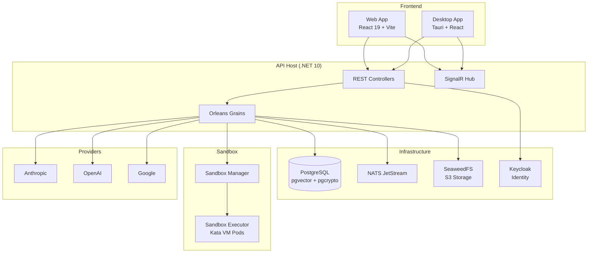

# DonkeyWork Agents

A multi-agent orchestration platform with a visual workflow editor, real-time chat, and distributed execution runtime. Build, manage, and execute LLM-powered agents with support for multiple providers, custom tools, and standard integration protocols.

## Features

- **Visual Workflow Editor** — drag-and-drop agent orchestration with ReactFlow, supporting start/end/action/model/utility nodes
- **Multi-Provider LLM Support** — Anthropic (Claude), OpenAI (GPT), and Google (Gemini) with a unified model catalog
- **Real-Time Chat** — multi-turn conversations with streaming output via SignalR
- **MCP Server** — Model Context Protocol support for dynamic tool registration and execution
- **A2A Protocol** — Agent-to-Agent communication for inter-agent messaging
- **Code Sandbox** — isolated code execution in Kata VM pods (Python, JavaScript, .NET)
- **Project Management** — projects, milestones, tasks, notes, and research tracking
- **OAuth Credential Management** — encrypted storage for API keys and OAuth tokens
- **Desktop App** — native macOS/Windows/Linux app via Tauri with OS notifications and auto-updates
- **Enterprise Auth** — Keycloak with JWT Bearer tokens and automatic per-user data isolation

## Architecture



### Execution Model

Agent orchestration uses Microsoft Orleans 10 actor grains:

- **ConversationGrain** — long-lived conversation orchestrator with message queuing
- **AgentGrain** — single-execution worker for sub-agent tasks
- **AgentRegistryGrain** — per-conversation tracker for spawned agents

The model pipeline processes requests through middleware: Accumulator → Usage Tracking → Tool Handling → Provider, with streaming results delivered back to clients via SignalR observers.

## Project Structure

```
src/
├── DonkeyWork.Agents.Api/              # API host, Program.cs, DI composition
├── common/
│   ├── Persistence/                    # Single DbContext, EF entities, migrations
│   ├── Common.Contracts/               # Shared enums, base interfaces
│   ├── Common.Sdk/                     # Internal utilities
│   └── Notifications.{Core,Contracts}/ # SignalR notification system
├── orchestrations/                     # Workflow definitions and execution
├── conversations/                      # Multi-turn chat with message history
├── credentials/                        # OAuth tokens, API keys (encrypted)
├── identity/                           # Keycloak auth, IIdentityContext
├── projects/                           # Projects, milestones, tasks, notes, research
├── actors/                             # Orleans grains, middleware pipeline, providers
├── mcp/                                # Model Context Protocol server
├── a2a/                                # Agent-to-Agent protocol
├── providers/                          # LLM provider definitions, model catalog
├── storage/                            # S3-compatible file management
├── agent-definitions/                  # Agent definition templates
├── prompts/                            # System and custom prompt library
├── lib/
│   ├── Orleans.Persistence.SeaweedFs/  # Custom Orleans grain storage
│   └── Orleans.Streaming.Nats/         # Custom Orleans streaming provider
├── frontend/
│   ├── apps/web/                       # Main web application
│   ├── apps/desktop/                   # Tauri desktop application
│   └── packages/                       # Shared packages (api-client, chat,
│                                       #   editor, platform, stores, ui, workspace)
└── sandbox/
    ├── CodeSandbox.Manager/            # Kubernetes pod orchestrator
    ├── CodeSandbox.Executor/           # Code runner (Python, JS, .NET)
    ├── CodeSandbox.AuthProxy/          # OAuth proxy sidecar
    └── CodeSandbox.Contracts/          # Shared models
```

Each backend module follows a three-layer pattern:
- **`{Module}.Contracts`** — DTOs, service interfaces, enums
- **`{Module}.Core`** — service implementations, business logic
- **`{Module}.Api`** — controllers, DI registration

## Tech Stack

| Layer | Technology |
|-------|-----------|
| Backend | .NET 10, ASP.NET Core, Microsoft Orleans 10 |
| Frontend | React 19, TypeScript, Vite 7, Tailwind CSS, shadcn/ui |
| Desktop | Tauri 2.10, Rust |
| Workflow Editor | ReactFlow v12 (@xyflow/react) |
| Database | PostgreSQL (pgvector + pgcrypto) |
| Message Broker | NATS JetStream |
| Object Storage | SeaweedFS (S3-compatible) |
| Identity | Keycloak (JWT + PKCE OAuth) |
| Real-Time | SignalR |
| Code Editor | Monaco Editor, CodeMirror |
| Rich Text | TipTap |
| Package Manager | pnpm (frontend monorepo) |

## Prerequisites

- [.NET 10 SDK](https://dotnet.microsoft.com/download)
- [Docker](https://docs.docker.com/get-docker/) and Docker Compose
- [Node.js 22+](https://nodejs.org/)
- [pnpm](https://pnpm.io/)

## Getting Started

### 1. Start Infrastructure

```bash
docker compose up -d postgres seaweedfs nats
```

This starts PostgreSQL (port 5433), SeaweedFS (port 8333), and NATS (port 4222).

You'll also need a Keycloak instance configured with a `donkeywork-agents-api` client. See `src/identity/readme.md` for auth setup details.

### 2. Run the API

```bash
dotnet run --project src/DonkeyWork.Agents.Api
```

The API starts on `http://localhost:5050` with Scalar API documentation available at the root.

### 3. Run the Frontend

```bash
cd src/frontend
pnpm install
pnpm dev
```

The web app starts on `http://localhost:5173`.

### 4. (Optional) Desktop App

```bash
cd src/frontend/apps/desktop
pnpm tauri dev
```

## Supported LLM Providers

| Provider | Models |
|----------|--------|
| Anthropic | Claude Opus 4.6, Claude Sonnet 4.6, Claude Haiku 4.5 |
| OpenAI | GPT-5, GPT-5 mini, GPT-5 nano |
| Google | Gemini 2.5 Pro, Gemini 2.5 Flash, Gemini 3 Pro, Gemini 3 Flash |

The model catalog includes capability flags (vision, audio, function calling, reasoning, streaming), token limits, and pricing metadata. Provider API keys are configured in the application settings or through the credentials UI.

## Build & Test

```bash
# Backend
dotnet build DonkeyWork.Agents.sln
dotnet test DonkeyWork.Agents.sln

# Frontend (from src/frontend)
pnpm run lint
pnpm exec tsc --noEmit
pnpm run test:run
pnpm run build
```

Integration tests require Docker (they use Testcontainers for PostgreSQL and NATS):

```bash
dotnet test test/integration/DonkeyWork.Agents.Integration.Tests/
```

## Configuration

Development configuration lives in `src/DonkeyWork.Agents.Api/appsettings.Development.json`. Key sections:

| Section | Purpose |
|---------|---------|
| `Persistence` | PostgreSQL connection string, data encryption key |
| `Keycloak` | Auth authority, audience, frontend URL |
| `Storage` | S3 service URL, credentials, default bucket |
| `Nats` | NATS URL, stream name, subject prefix |
| `Anthropic` | API key, default model |
| `Sandbox` | Sandbox manager base URL |

All configuration uses the `IOptions<T>` pattern with startup validation.

## License

See [LICENSE](LICENSE) for details.
